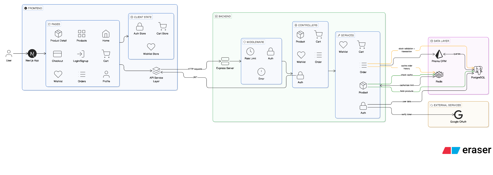

# Amazon Clone

A full-stack Amazon-style ecommerce application built with Next.js, Express, Prisma, PostgreSQL, Redis, and JWT authentication.

## Live Demo

Production demo: [https://amazon-clone-123-ruby.vercel.app/](https://amazon-clone-123-ruby.vercel.app/)

## Overview

This project includes:

- Product browsing with search, category filtering, and caching
- Product detail pages
- Cart and wishlist management
- Email/password login and Google login
- Checkout and order placement
- Paginated order history
- Redis-backed caching
- API rate limiting

## Tech Stack

### Frontend

- Next.js App Router
- React 19
- TypeScript
- Tailwind CSS
- Zustand
- React Hot Toast

### Backend

- Node.js
- Express
- Prisma ORM
- PostgreSQL
- Redis
- JWT authentication

## Core Features

- Home page product discovery
- Product search and category filtering
- Product detail experience
- Add to cart
- Wishlist management
- Signup and login
- Google authentication
- Checkout flow
- Order placement
- Order history with pagination
- Route-aware auth redirect after login/signup
- Loading states and skeleton UI
- Header order counter

## Architecture Summary

### Frontend Layers

1. `app/`
   Handles route-level UI such as home, cart, checkout, login, signup, orders, profile, and wishlist.
2. `components/`
   Reusable UI blocks like header, product list, Google auth button, order button, and layout sections.
3. `service/api.ts`
   Central HTTP client for backend communication.
4. `lib/store.ts`
   Zustand client state for auth, cart, and favorites.
5. `lib/authRedirect.ts`
   Shared redirect helper for preserving the page users came from.

### Backend Layers

1. `routes/`
   Defines API endpoints.
2. `controllers/`
   Handles request/response orchestration.
3. `services/`
   Contains business logic for auth, products, cart, wishlist, and orders.
4. `middlewares/`
   Auth, error handling, and rate limiting.
5. `config/`
   Prisma and Redis connection setup.
6. `utils/`
   JWT, hashing, cache helpers, and response helpers.

## System Architecture

```text
User Browser
   |
   v
Next.js Frontend
   |
   v
API Service Layer (Frontend/service/api.ts)
   |
   v
Express API Server
   |
   +--> Auth Middleware
   +--> Rate Limit Middleware
   +--> Controllers
   +--> Services
   |
   +--> PostgreSQL via Prisma
   |
   +--> Redis Cache / Rate Limit Storage
```

## Main Functional Flows

### 1. Product Browsing Flow

```text
User opens Home / Products
-> Next.js page requests products
-> Frontend service calls GET /api/products
-> Product controller calls product service
-> Product service checks Redis cache
-> If cache miss, query PostgreSQL with Prisma
-> Response returned to frontend
-> UI renders product cards
```

### 2. Authentication Flow

```text
User opens login/signup
-> Submits credentials or Google token
-> Frontend calls /api/auth/login, /api/auth/register, or /api/auth/google
-> Backend validates user
-> JWT token returned
-> Zustand stores token and user
-> User is redirected back to original route
```

### 3. Cart Flow

```text
User adds product to cart
-> Zustand updates local cart instantly
-> If authenticated, frontend also calls /api/cart
-> Backend stores cart item in database
-> Cart page computes subtotal and checkout state
```

### 4. Checkout and Order Flow

```text
User clicks checkout
-> If not logged in, redirect to login with redirect=/checkout
-> User fills shipping form
-> Frontend calls POST /api/orders
-> Backend validates items and quantities
-> Backend fetches actual product prices from database
-> Backend checks stock availability
-> Backend creates order in transaction
-> Backend decrements stock
-> Backend clears related cart rows
-> Backend invalidates product/order cache
-> Frontend clears cart state
-> User is redirected to /orders
```

### 5. Order History Flow

```text
User opens /orders
-> Frontend calls GET /api/orders/history?page=1&limit=5
-> Backend checks auth
-> Rate limiter allows request
-> Order service checks Redis cache
-> If cache miss, Prisma loads paginated orders
-> Response returns total, page, limit, hasMore, items
-> Frontend renders orders and pagination controls
```

## API Surface

### Auth

- `POST /api/auth/register`
- `POST /api/auth/login`
- `POST /api/auth/google`

### Products

- `GET /api/products`
- `GET /api/products/:id`

### Cart

- `GET /api/cart`
- `POST /api/cart`
- `DELETE /api/cart/:id`

### Wishlist

- `GET /api/wishlist`
- `POST /api/wishlist`

### Orders

- `POST /api/orders`
- `GET /api/orders/history?page=1&limit=5`

## Database Model Summary

Main entities used in the system:

- `User`
- `Category`
- `Product`
- `ProductImage`
- `Cart`
- `Wishlist`
- `Order`
- `OrderItem`

Relationships:

- One user can have many cart items
- One user can have many wishlist items
- One user can have many orders
- One category can have many products
- One product can have many images
- One order can have many order items

## Redis Usage

Redis is used for:

- Product list caching
- Product detail caching
- Paginated order history caching
- Rate limiting counters

## Security and Stability Improvements Added

- JWT-protected private routes
- Server-authoritative order pricing
- Stock validation before order placement
- Transactional order creation
- Redis-backed cache invalidation after order placement
- Global API rate limiting
- Extra auth route rate limiting
- Extra order route rate limiting


## Diagram




## Project Structure

```text
Frontend/
  app/
  assets/
  components/
  lib/
  service/

Backend/
  src/
    config/
    controllers/
    middlewares/
    routes/
    services/
    utils/
  prisma/
```

## How To Run

### Frontend

```bash
cd Frontend
npm install
npm run dev
```

### Backend

```bash
cd Backend
npm install
npm run dev
```

## Notes
- Frontend runs on `http://localhost:3000`
- Backend runs on `http://localhost:8000`
- Redis is optional but improves caching and rate limiting
- PostgreSQL is required for persistent data
